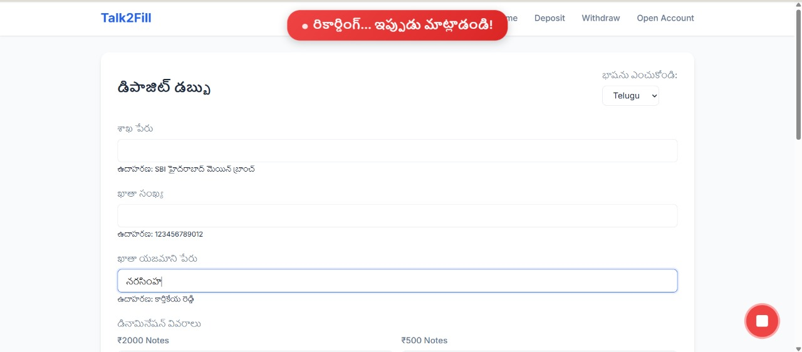
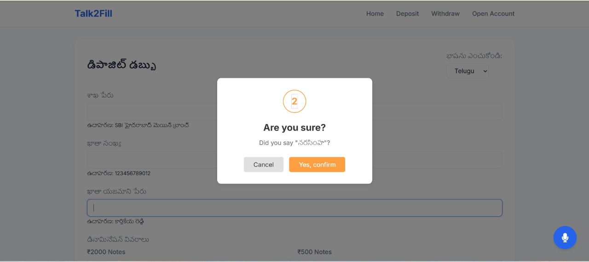
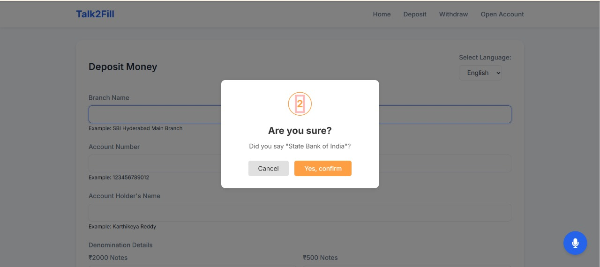

# Talk2Fill - Voice Assistant for Form Filling

A modern web application that provides voice-powered form filling capabilities for banking operations. Users can interact with banking forms using voice commands in multiple languages (English, Hindi, and Telugu) to fill out deposit, withdrawal, and account opening forms.

## 🚀 Features

### Core Functionality
- **Voice Recognition**: Real-time speech-to-text conversion for form filling
- **Multi-language Support**: English, Hindi, and Telugu language support
- **Form Auto-filling**: Intelligent form field detection and auto-completion
- **PDF Generation**: Automatic PDF generation for completed forms
- **Session Management**: Track voice recordings and form data per session

### Banking Operations
- **Deposit Forms**: Voice-guided deposit slip filling
- **Withdrawal Forms**: Voice-guided withdrawal slip filling  
- **Account Opening**: Voice-guided new account application forms

### Technical Features
- **Real-time Translation**: Speech translation between supported languages
- **Database Storage**: SQLite database for storing voice recordings and generated PDFs
- **RESTful API**: Backend API for voice recording and PDF management
- **Responsive Design**: Modern, mobile-friendly UI
- **CORS Support**: Cross-origin resource sharing enabled

## 🛠️ Technology Stack

### Backend
- **Flask**: Python web framework
- **SQLAlchemy**: Database ORM
- **SQLite**: Database for storing recordings and PDFs
- **Flask-CORS**: Cross-origin resource sharing

### Frontend
- **HTML5**: Semantic markup
- **CSS3**: Modern styling with CSS variables
- **JavaScript**: Voice recognition and form handling
- **Web Speech API**: Browser-based speech recognition

### Dependencies
- `flask==2.0.1`
- `SpeechRecognition==3.8.1`
- `googletrans==3.1.0a0`
- `SQLAlchemy==1.4.49`
- `flask-cors==3.0.10`
- `gunicorn`
- `werkzeug==2.0.3`

## 📁 Project Structure

```
Voice-assistant-for-form-filling/
├── app.py                          # Main Flask application
├── models.py                       # Database models
├── requirements.txt                # Python dependencies
├── Procfile                        # Heroku deployment configuration
├── googlea813a59efe742152.html     # Google verification file
├── NotoSansDevanagari-Regular.ttf  # Hindi font
├── NotoSansTelugu-Regular.ttf      # Telugu font
├── templates/                      # HTML templates
│   ├── index.html                  # Home page
│   ├── deposit.html                # Deposit form page
│   ├── withdraw.html               # Withdrawal form page
│   └── account-opening.html        # Account opening form page
├── static/                         # Static assets
│   ├── css/
│   │   ├── styles.css              # Main stylesheet
│   │   └── account-opening.css     # Account opening specific styles
│   └── js/
│       └── main.js                 # Main JavaScript functionality
└── instance/                       # Database instance
    └── banking.db                  # SQLite database file
```

## 🚀 Installation & Setup

### Prerequisites
- Python 3.7 or higher
- pip (Python package installer)
- Modern web browser with microphone access

### Installation Steps

1. **Clone the repository**
   ```bash
   git clone <repository-url>
   cd Voice-assistant-for-form-filling/testing/NEW
   ```

2. **Create a virtual environment**
   ```bash
   python -m venv venv
   # On Windows
   venv\Scripts\activate
   # On macOS/Linux
   source venv/bin/activate
   ```

3. **Install dependencies**
   ```bash
   pip install -r requirements.txt
   ```

4. **Run the application**
   ```bash
   python app.py
   ```

5. **Access the application**
   Open your browser and navigate to `http://localhost:5000`

## 📱 Usage

### Getting Started
1. **Home Page**: Navigate to the main page to see available banking operations
2. **Language Selection**: Choose your preferred language (English/Hindi/Telugu)
3. **Form Selection**: Click on Deposit, Withdraw, or Open Account
4. **Voice Input**: Click the microphone button and speak your information
5. **Form Completion**: Watch as the form auto-fills based on your voice input
6. **PDF Generation**: Download the completed form as a PDF


## 🎨 Screenshots






### Local Development
```bash
python app.py
```

## 🔒 Security Features

- **CORS Protection**: Configured for secure cross-origin requests
- **Input Validation**: Form data validation and sanitization
- **Session Management**: Secure session tracking
- **Database Security**: SQLAlchemy ORM prevents SQL injection

## 🤝 Contributing

1. Fork the repository
2. Create a feature branch: `git checkout -b feature-name`
3. Commit changes: `git commit -am 'Add feature'`
4. Push to branch: `git push origin feature-name`
5. Submit a pull request

## 📝 License

This project is licensed under the MIT License - see the LICENSE file for details.

## 🐛 Troubleshooting

### Common Issues

1. **Microphone not working**
   - Ensure browser has microphone permissions
   - Check if HTTPS is required for voice recognition

2. **Voice recognition not responding**
   - Check internet connection (required for Google Speech API)
   - Verify language selection matches your speech

3. **PDF generation fails**
   - Check browser console for errors
   - Ensure all form fields are properly filled

4. **Database errors**
   - Delete `instance/banking.db` to reset database
   - Restart the application

## 📞 Support

For support and questions, please open an issue in the repository or contact the development team.

## 🔮 Future Enhancements

- [ ] Additional language support
- [ ] Advanced voice commands
- [ ] Integration with banking APIs
- [ ] Enhanced security features


